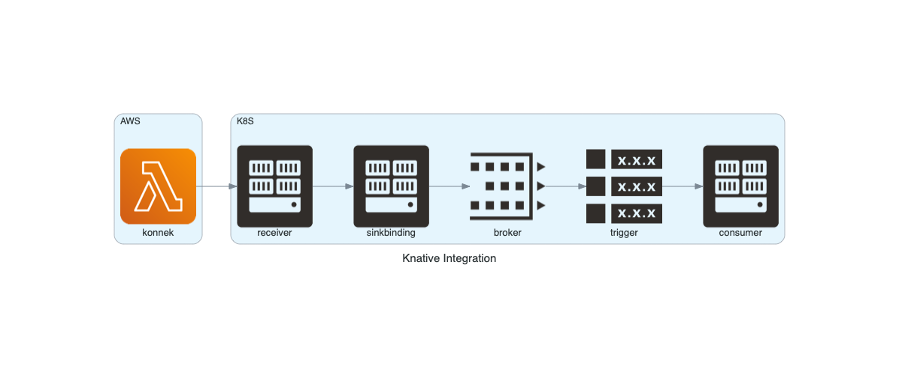

# Integrating with Knative

The integration uses the Knative native eventing resources, like `SinkBinding`, `Broker` and `Trigger`.

Here's the event flow:



1. The event arrives from Konnek into a Knative Serivce called `receiver`
1. `receiver` forwards the event to a Broker called `default` through a `SinkBinding` configuration
1. A `Trigger` watches the `default` Broker for messages of a specific type
1. Once there's a match, the `consumer` Service receives the message 

This guide requires a Knative Broker named `default` in the `default` namespace.

## Setting up Knative
Install the consumer:
```bash
cat <<EOF | kubectl apply -f -
apiVersion: serving.knative.dev/v1
kind: Service
metadata:
  name: konnek-consumer
  labels:
    serving.knative.dev/visibility: cluster-local
spec:
  template:
    spec:
      containers:
      - image: konnek/consumer
EOF
```

Install the receiver:
```bash
cat <<EOF | kubectl apply -f -
apiVersion: serving.knative.dev/v1
kind: Service
metadata:
  name: konnek-receiver
spec:
  template:
    metadata: 
      annotations:
        # avoiding cold start
        autoscaling.knative.dev/minScale: "1"
    spec:
      containers:
      - image: konnek/knative-receiver
EOF
```

Install the SinkBinding:
```bash
cat <<EOF | kubectl apply -f -
apiVersion: sources.knative.dev/v1alpha1
kind: SinkBinding
metadata:
  name: konnek-sinkbinding
spec:
  subject:
    apiVersion: serving.knative.dev/v1
    kind: Service
    name: konnek-receiver
  sink:
    ref:
      apiVersion: eventing.knative.dev/v1beta1
      kind: Broker
      name: default
EOF
```

Create an example Trigger for the AWS SQS event type. See all supported events [here](/supported-events.md).
```bash
cat <<EOF | kubectl apply -f -
apiVersion: eventing.knative.dev/v1beta1
kind: Trigger
metadata:
  name: konnek-trigger-aws-sqs
spec:
  broker: default
  filter:
    attributes:
      # you can try over events!
      type: com.amazon.sqs
  subscriber:
    ref:
      apiVersion: serving.knative.dev/v1
      kind: Service
      name: konnek-consumer
EOF
```

Get the `receiver` external address:
```bash
kubectl get ksvc konnek-receiver -o jsonpath="{.status.url}"
```

With the external address, go ahead and setup one of the Konnek providers, like [AWS](getting-started/installing-konnek-for-aws.md) or [GCP](getting-started/installing-konnek-for-gcp.md).

After setting up a provider – let's say, AWS – fire a SQS event and see it in the `consumer` logs. Here, we are using [stern](https://github.com/wercker/stern):
```bash
stern -l serving.knative.dev/service=konnek-consumer -c user-container
```

```
... user-container 2020/04/25 18:35:50 Validation: valid
... user-container Context Attributes,
... user-container   specversion: 1.0
... user-container   type: com.amazon.sqs
... user-container   source: arn:aws:sqs:eu-central-1:123456789012:MyQueue
... user-container   id: 1b6a181f-42bb-40e0-a95a-b54baf2795f0
... user-container   time: 2020-04-25T18:35:50.821658085Z
... user-container   datacontenttype: application/json
... user-container Extensions,
... user-container   knativearrivaltime: 2020-04-25T18:35:50.826800825Z
... user-container   knativehistory: default-kne-trigger-kn-channel.default.svc.cluster.local
... user-container   traceparent: 00-1fdfa2325a20d35b622a8ad2262566ff-d8445a2b188ba72f-00
... user-container Data,
... user-container   {
... user-container     "Records": [
... user-container       {
... user-container         "attributes": {
... user-container           "ApproximateFirstReceiveTimestamp": "1523232000001",
... user-container           "ApproximateReceiveCount": "1",
... user-container           "SenderId": "123456789012",
... user-container           "SentTimestamp": "1523232000000"
... user-container         },
... user-container         "awsRegion": "eu-central-1",
... user-container         "body": "Hello from SQS!",
... user-container         "eventSource": "aws:sqs",
... user-container         "eventSourceARN": "arn:aws:sqs:eu-central-1:123456789012:MyQueue",
... user-container         "md5OfBody": "7b270e59b47ff90a553787216d55d91d",
... user-container         "messageAttributes": {},
... user-container         "messageId": "19dd0b57-b21e-4ac1-bd88-01bbb068cb78",
... user-container         "receiptHandle": "MessageReceiptHandle"
... user-container       }
... user-container     ]
... user-container   }
```